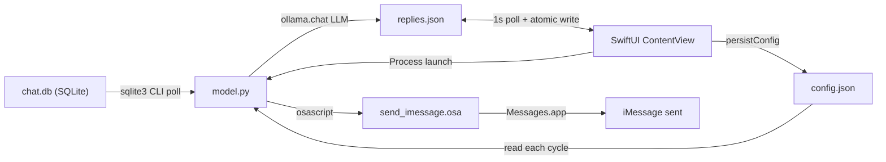

# iMessageAI

Event-driven iMessage reply system for macOS. Watches the local `chat.db` SQLite store for incoming messages, generates mood-conditioned replies via a local Ollama LLM, presents candidates in a SwiftUI interface for human-in-the-loop selection, and sends the chosen reply through AppleScript automation.

## Files

| File | Role |
|---|---|
| `model.py` | Python daemon: polls `chat.db`, constructs personality prompts, calls Ollama, writes `replies.json`, sends via `osascript` |
| `send_imessage.osa` | AppleScript: sends a message through Messages.app |
| `config.json` | Personality config: name, description, moods, phone filter |
| `requirements.txt` | Python dependencies (`ollama`) |
| `iMessageAI/iMessageAIApp.swift` | SwiftUI `@main` entry; hosts `ContentView` in a `WindowGroup` |
| `iMessageAI/ContentView.swift` | UI + process orchestration: config editing, `replies.json` polling, `model.py` lifecycle |
| `iMessageAI/Assets.xcassets/` | App icons and accent color |
| `iMessageAI.xcodeproj/` | Xcode project |
| `test_model.py` | Python unit tests (65): `validate_config`, `should_process`, `normalize_phone`, `atomic_write_json`, `query_db`, `gen_replies`, `_safe_rowid`, SQL integration (real SQLite), live Ollama integration, user setup verification (real `chat.db`) |
| `iMessageAITests/ContentViewTests.swift` | Swift unit tests (12): `readRepliesFile` JSON parsing, fallbacks, edge cases |
| `scripts/demo.sh` | Verification script: checks files, config, syntax, imports |
| `scripts/open-product-bundle.sh` | Opens pre-built `.app` bundle if present |
| `.github/workflows/ci.yml` | CI: Ollama install + model pull, smoke test, Python tests, live LLM integration, FDA grant, Xcode build + Swift tests on `macos-26` |

## Entry Points

| Entry Point | Language | Role |
|---|---|---|
| `iMessageAI/iMessageAIApp.swift` | Swift | `@main`; `WindowGroup` hosts `ContentView` |
| `iMessageAI/ContentView.swift` | Swift | UI, config persistence, `model.py` process management, `replies.json` polling |
| `model.py` | Python | Daemon: DB poll, LLM generation, IPC via `replies.json`, send via `osascript` |
| `send_imessage.osa` | AppleScript | Sends iMessage given phone number and text |

## Verification

Smoke test (files, config, syntax, imports):

```bash
bash scripts/demo.sh
```

Pass when output contains `SMOKE_OK`.

Unit tests (requires `ollama` package):

```bash
python3 -m unittest test_model -v
```

Tests cover `validate_config`, `should_process`, `normalize_phone`, `atomic_write_json`, `query_db`, `gen_replies`, `_safe_rowid`, and SQL integration against a real temporary SQLite database (`QUERY_LATEST`, `QUERY_SINCE` with schema matching `chat.db`).

Live Ollama integration test (requires running Ollama with `llama3.1:8b`):

```bash
CI_LIVE_OLLAMA=1 python3 -m unittest test_model.TestLiveOllama -v
```

User setup verification (requires macOS with Full Disk Access granted to the terminal):

```bash
USER_SETUP_TEST=1 python3 -m unittest test_model.TestUserSetup -v
```

Validates that `~/Library/Messages/chat.db` is readable, `QUERY_LATEST` and `QUERY_SINCE` return expected columns, inbound messages exist, and handle IDs are populated.

Xcode build and Swift tests:

```bash
xcodebuild test -project iMessageAI.xcodeproj -scheme iMessageAI -configuration Debug -destination 'platform=macOS'
```

Swift tests cover `readRepliesFile` JSON parsing: full payloads, Reply/Refresh/Ignore states, time type coercion, nested replies, missing fields, lowercase key fallback.

CI runs all of the above plus live Ollama generation and FDA grant. User setup tests verify the real `chat.db`. Full end-to-end additionally requires signed-in Messages and a real incoming iMessage.

## Architecture



### Execution flow

1. SwiftUI host launches `model.py` as a child process (auto-restart on exit)
2. `model.py` polls `chat.db` via `sqlite3` CLI for the latest message ROWID
3. On new message from an allowed phone number: reads `config.json`, builds personality prompt with mood definitions
4. Ollama generates JSON with one reply per mood (retries up to 5 times on key mismatch)
5. `model.py` atomically writes the reply map to `replies.json`
6. SwiftUI polls `replies.json` every 1s and displays mood-labeled reply cards
7. User selects a card, edits text if needed, then taps Reply / Refresh / Ignore
8. `model.py` reads the selection and invokes `send_imessage.osa` via `osascript`

### IPC contracts

- **model.py -> replies.json:** flat JSON with mood keys plus `Reply`, `sender`, `message`, `time`
- **SwiftUI -> replies.json:** writes `Reply` key (`""` = waiting, `"Refresh"` = regenerate, `"Ignore"` = skip, mood name = send)
- **SwiftUI -> config.json:** atomic write of name, description, moods, phone filter
- **model.py -> send_imessage.osa:** `subprocess.run(['osascript', 'send_imessage.osa', number, text])`

## Prerequisites

- macOS with Full Disk Access granted to Terminal/Xcode
- Xcode installed
- Ollama installed and running (`brew install ollama && ollama serve`)
- Llama 3.1 8B pulled (`ollama pull llama3.1:8b`)
- Python 3.9+ with `ollama` package (`pip install -r requirements.txt`)
- Messages signed into iMessage

## Quick Start

```bash
git clone git@github.com:cadenroberts/llm-messaging-system.git
cd llm-messaging-system
pip install -r requirements.txt
mkdir -p ~/iMessageAI
cp model.py config.json send_imessage.osa ~/iMessageAI/
open iMessageAI.xcodeproj  # Product > Run (Cmd+R)
```

Alternatively, if a pre-built bundle exists: `./scripts/open-product-bundle.sh`
